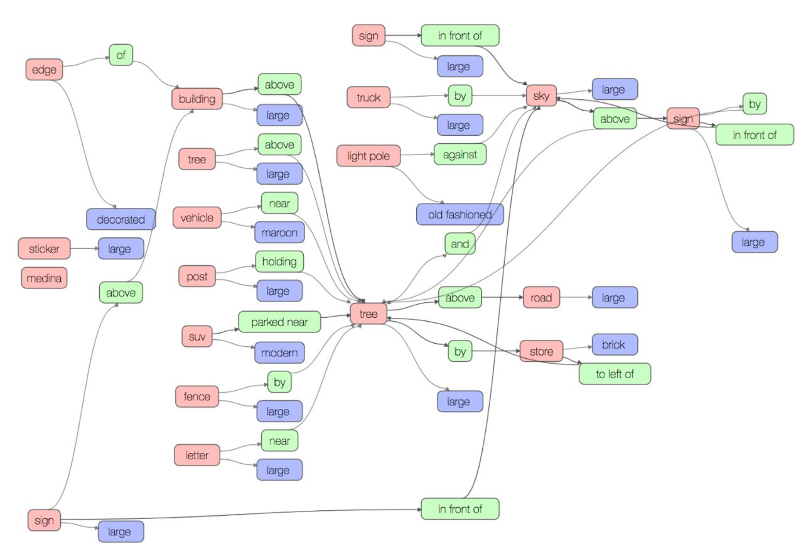

# DeepVariationStructuredRL
This repository contains a PyTorch implementation of the [Deep Variation-structured Reinforcement Learning for Visual Relationship and Attribute Detection](https://arxiv.org/abs/1703.03054) paper by Liang et. al [5].

## Setup

### Downloading the Data
First create a folder called data in the root folder of the repository (`mkdir data`). We will be using the [Visual Genome Dataset](http://visualgenome.org) to train this network. Follow the steps below to obtain the necessary data.

1. You can access the first part of the data set [here](https://cs.stanford.edu/people/rak248/VG_100K_2/images.zip) and the second part [here](https://cs.stanford.edu/people/rak248/VG_100K_2/images2.zip). Once you have downloaded both parts, create a folder that contains all the images from both parts in a single folder called VG_100K in the data folder.
2. Inside the data folder, create a folder called raw_data. Download the following files inside this new folder. Be sure to unzip the zip files.
<pre><code>wget http://visualgenome.org/static/data/dataset/objects.json.zip
wget http://visualgenome.org/static/data/dataset/relationships.json.zip
wget http://visualgenome.org/static/data/dataset/object_alias.txt
wget http://visualgenome.org/static/data/dataset/relationship_alias.txt
wget http://visualgenome.org/static/data/dataset/attributes.json.zip
wget http://visualgenome.org/static/data/dataset/scene_graphs.json.zip</code></pre>
3. Create a folder called data_samples inside the data file. This is where the train, validation, and test files will be placed.

### Dependencies
We will be using Pytorch and other Python libraries to create our VRL model. Follow the instructions below to obtaint the necessary dependencies

1. Install the appropriate version of Pytorch for your system from the [Pytorch website](http://pytorch.org/).
2. Run `pip install -r requirements.txt`
3. Do the following if you want to use Faster RCNN to generate box proposals and class labels, rather than using ground truth. We are using the faster rcnn implementation from [here](https://github.com/longcw/faster_rcnn_pytorch).
* `cd faster_rcnn`
* `./make.sh`
* Download the faster-rcnn model [here](https://drive.google.com/open?id=0B4pXCfnYmG1WOXdpYVFybWxiZFE) to the same directory as main.py
* Make sure cuda is in your PATH (ex: `export PATH=$PATH:/usr/local/cuda/bin`)
4. Do the following if you want to include skip thought history embeddings in your state vectors. We are using the skip thought implementation from [here](https://github.com/ryankiros/skip-thoughts).
* `cd skipthoughts`
* Download the following:
<pre><code>wget http://www.cs.toronto.edu/~rkiros/models/dictionary.txt
wget http://www.cs.toronto.edu/~rkiros/models/utable.npy
wget http://www.cs.toronto.edu/~rkiros/models/btable.npy
wget http://www.cs.toronto.edu/~rkiros/models/uni_skip.npz
wget http://www.cs.toronto.edu/~rkiros/models/uni_skip.npz.pkl
wget http://www.cs.toronto.edu/~rkiros/models/bi_skip.npz
wget http://www.cs.toronto.edu/~rkiros/models/bi_skip.npz.pkl</code></pre>

### Create the Semantic Action Graph and Data Files
Run `./setup.sh`. This will create predicate_counts.json, attribute_counts.json, and entity_counts.json which contains the number of times a predicate, attribute, entity (respectively) have occured in the Visual Genome dataset. This will be used to create the semantic action graph, which is saved as graph.pickle. We only consider predicates, attributes, and entities that have appeared at least 200 times. You can change this parameter by including a `--min_occurances` flag when running create_semantic_action_graph.py in setup.sh. The smaller this number is, the larger your graph will be. Lastly, train_data.json, validation_data.json, and test_data.json are created in data/data_samples/ which are used to train/evaluate the model.  

## Training
To begin training the network, run

`python main.py --train`

## Evaluation
To evalutate a pretrained model, run

`python main.py --evaluate`

Add the `--visualize <number>` flag to save <number> scene graph diagrams to `visualizations/`.
  
## Viewing Visualizations
After running main.py with the `--train` or `--evaluate` flag, a file called image_states.pickle will be created. image_states.pickle will be created after going through at least one epoch when using the `--train` flag. Move image_states.pickle into the graphviz folder (`mv image_states.pickle graphviz`). Then run the following commands:

1. Run `python pickle_to_files.py`. This will create 2 JSON files for each image; one representing the ground truth scene graph and the other representing the scene graph created by the VRL model.
2. Run `python visualize_scene_graph.py --graph <JSON filename>` to visualize the graph represented by the JSON file.

## Results
Below we have included one example of a scene graph generated using VRL.

Generated Scene Graph

## Poster
This project was originally done for a Reinforcement Learning class at Stanford University (CS234). The poster for this project can be found [here](poster.pdf) and the final report can be found [here](https://drive.google.com/file/d/10y1mYCvm7Q6Y4HLyBAmX2neYFcGwUl9x/view?usp=sharing).

Citations:

[1] Danfei Xu, Yuke Zhu, Christopher B Choy, and Li Fei-Fei. Scene graph generation by iterative message passing. In Proceedings of the IEEE Conference on Computer Vision and Pattern Recognition, 2017.

[2] Newell, Alejandro, and Jia Deng. “Pixels to Graphs by Associative Embedding.” [1706.07365] Pixels to Graphs by Associative Embedding, 22 June 2017, arxiv.org/abs/1706.07365.

[3] Ranjay Krishna, Yuke Zhu, Oliver Groth, Justin Johnson, Kenji Hata, Joshua Kravitz, Stephanie Chen, Yannis Kalantidis, Li-Jia Li, David A Shamma, Michael Bernstein, and Li Fei-Fei. Visual genome: Connecting language and vision using crowdsourced dense image annotations. 2016.

[4] Huang, Gao and Liu, Zhuang and van der Maaten, Laurens and Weinberger, Kilian Q, \textit{Densely connected convolutional networks}, Proceedings of the IEEE Conference on Computer Vision and Pattern Recognition, 2017

[5] X. Liang, L. Lee, and E. P. Xing. Deep variation-structured reinforcement
learning for visual relationship and attribute detection. In
CVPR, 2017

[6] S. Ren, K. He, R. Girshick, and J. Sun. Faster R-CNN: Towards
real-time object detection with region proposal networks. In NIPS,
2015

[7] Mnih, Volodymyr, Kavukcuoglu, Koray, Silver, David,
Rusu, Andrei A., Veness, Joel, Bellemare, Marc G.,
Graves, Alex, Riedmiller, Martin, Fidjeland, Andreas K.,
Ostrovski, Georg, Petersen, Stig, Beattie, Charles, Sadik,Amir, Antonoglou, Ioannis, King, Helen, Kumaran,
Dharshan, Wierstra, Daan, Legg, Shane, and Hassabis,
Demis. Human-level control through deep reinforcement
learning. Nature, 518(7540):529–533, 02 2015

[8] Van Hasselt, Hado, Guez, Arthur, and Silver, David. Deep
reinforcement learning with double q-learning. arXiv
preprint arXiv:1509.06461, 2015.
